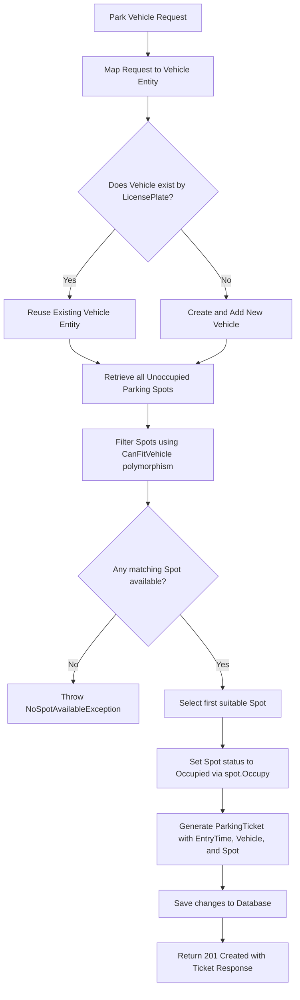
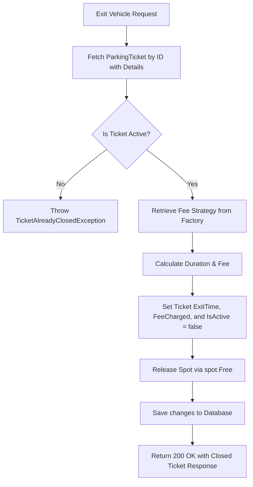

# Online Parking Lot System API

A comprehensive, multi-floor parking lot management system API built with ASP.NET Core 10, Entity Framework Core, and MySQL. It manages vehicle check-in, check-out, dynamic fee calculations, and active parking monitoring.

---

## 1. Project Concept & Idea

The API provides a backend for managing a physical parking facility with multiple floors, where each floor contains various types of parking spots. The system automates:
1. **Spot Allocation**: When a vehicle arrives, the API automatically finds an available parking spot that matches the vehicle's size.
2. **Parking Tracking**: Issues a ticket with entry details, linking the vehicle to its assigned spot.
3. **Billing on Exit**: When the vehicle leaves, the system computes the exact elapsed duration, applies a chosen fee strategy, closes the ticket, and marks the spot as vacant.

---

## 2. System Workflow & Logical Flow

### A. Vehicle Check-In Flow (`POST /api/parking/park`)
The following step-by-step sequence is executed during vehicle check-in:



1. **Request Reception**: Receives the vehicle's license plate, owner's name, vehicle type, and preferred fee strategy.
2. **Vehicle Validation**: Checks if the vehicle already exists in the database. If it does, the existing record is reused to maintain history; otherwise, a new vehicle record is added.
3. **Spot Discovery (LINQ)**: Queries all vacant parking spots on all floors, eager-loading floor details.
4. **Size Validation (Polymorphism)**: Iterates through vacant spots, executing the `CanFitVehicle(vehicle)` method which evaluates size matching:
   - **Motorcycle** fits in `CompactSpot`, `HandicappedSpot`, and `LargeSpot`.
   - **Car** fits in `HandicappedSpot` and `LargeSpot`.
   - **Truck** fits only in `LargeSpot`.
5. **State Transition (Encapsulation)**: Reserves the selected spot by calling `spot.Occupy()`, changing the spot's `IsOccupied` status.
6. **Ticket Generation**: Generates a new `ParkingTicket` starting at `DateTime.UtcNow`.

---

### B. Vehicle Check-Out Flow (`PUT /api/parking/exit/{ticketId}`)
The exit process follows this workflow:



1. **Ticket Fetching**: Retrieves the active ticket using its ID. If it does not exist, a `TicketNotFoundException` is thrown.
2. **State Verification**: Verifies the ticket's active state. If it is already closed, a `TicketAlreadyClosedException` is thrown.
3. **Fee Strategy Resolution**: Resolves the strategy from `FeeCalculatorFactory` using the ticket's `FeeType`.
4. **Calculations**: Calculates the duration (`ExitTime - EntryTime`) and matches it with the billing logic.
5. **State Reset**: Updates ticket details, closes it, and calls `spot.Free()` to set `IsOccupied` to `false`.

---

## 3. Duration & Billing Calculations

Billing relies on the **Strategy Pattern** which separates calculation logic into isolated classes under a shared interface.

### The Calculation Logic
The duration is computed as:
$$\text{Duration} = \text{Exit Time} - \text{Entry Time}$$

Each strategy processes this duration differently:

1. **Hourly Strategy (`HourlyFeeCalculator`)**
   - **Rate**: Rs 50 per hour.
   - **Rounding**: Fractional hours are rounded up to the next full hour (using `Math.Ceiling`).
   - *Example*: A parking duration of 1 hour and 5 minutes is billed as 2 hours ($2 \times 50 = \text{Rs 100}$).

2. **Daily Strategy (`DailyFeeCalculator`)**
   - **Rate**: Rs 500 per day.
   - **Rounding**: Fractional days are rounded up to the next full day.
   - *Example*: A parking duration of 25 hours (1 day and 1 hour) is billed as 2 days ($2 \times 500 = \text{Rs 1000}$).

3. **Flat Strategy (`FlatFeeCalculator`)**
   - **Rate**: Rs 200 fixed cost.
   - **Rounding**: Irrelevant. The price remains Rs 200 regardless of the duration.

---

## 4. Database Schema & Relationships

The database mapping is handled by Entity Framework Core using a MySQL provider.

```
  +------------------+          +------------------+          +------------------+
  |    ParkingLots   |          |      Floors      |          |   ParkingSpots   |
  +------------------+          +------------------+          +------------------+
  | Id (PK)          |1       * | Id (PK)          |1       * | Id (PK)          |
  | Name             |--------->| FloorNumber      |--------->| SpotNumber       |
  | Address          |          | ParkingLotId (FK)|          | Type (Enum)      |
  +------------------+          +------------------+          | IsOccupied       |
                                                              | FloorId (FK)     |
                                                              | Discriminator    |
                                                              +------------------+
                                                                       | 1
                                                                       |
                                                                       | 1 (Active)
                                                                       v
  +------------------+          +------------------+          +------------------+
  |     Vehicles     |          |  ParkingTickets  |          |  ParkingTickets  |
  +------------------+          +------------------+          +------------------+
  | Id (PK)          |1       * | Id (PK)          | *      1 | (Relationships   |
  | LicensePlate     |--------->| EntryTime        |<---------|  represented to  |
  | OwnerName        |          | ExitTime         |          |   the left and   |
  | Type (Enum)      |          | FeeCharged       |          |      above)      |
  | Discriminator    |          | IsActive         |          +------------------+
  +------------------+          | FeeType (Enum)   |
                                | VehicleId (FK)   |
                                | ParkingSpotId(FK)|
                                +------------------+
```

### Inheritance Mapping (Table-Per-Hierarchy)
To represent subclass structures inside a relational schema:
- **Vehicles Table**: Both `Motorcycle`, `Car`, and `Truck` are stored in the `Vehicles` table. EF Core automatically adds a `Discriminator` column to identify the concrete subclass.
- **ParkingSpots Table**: `CompactSpot`, `LargeSpot`, and `HandicappedSpot` are stored in the `ParkingSpots` table, mapped using a `Discriminator` column.

### Core Relationships
- **One-to-Many**: A `ParkingLot` has multiple `Floors`. A `Floor` has multiple `ParkingSpots`.
- **Many-to-One**: A `ParkingTicket` connects to one `Vehicle` and one `ParkingSpot`.
- **Active Spot Limit**: A spot can have at most one active ticket linked to it at any given time (enforced during check-in by checking `!spot.IsOccupied`).

### Delete Behaviors (Cascade vs. Restrict)
To protect financial records and system integrity, custom deletion rules are configured using the Fluent API:
- **Cascade Delete**: Deleting a `ParkingLot` automatically deletes all its `Floors` and `ParkingSpots` as they are physical child components of the facility.
- **Restrict Delete**: Deleting a `Vehicle` or `ParkingSpot` is blocked if they have any associated `ParkingTicket` history records. This prevents loss of audit logs and accounting history.

---

## 5. API Endpoints

### Authentication
- **`POST /api/auth/login`**
  - **Auth**: Public
  - **Description**: Authenticates admin using hardcoded credentials and returns a JWT token.
  - **Body**:
    ```json
    {
      "username": "admin",
      "password": "admin123"
    }
    ```

### Parking Operations
- **`POST /api/parking/park`**
  - **Auth**: Bearer Token (JWT) required
  - **Description**: Registers a vehicle check-in. Finds an available spot matching the vehicle size and creates a ticket.
  - **Body**:
    ```json
    {
      "licensePlate": "XYZ-987",
      "ownerName": "John Doe",
      "vehicleType": 1,
      "feeType": 0
    }
    ```

- **`PUT /api/parking/exit/{ticketId}`**
  - **Auth**: Bearer Token (JWT) required
  - **Description**: Registers a vehicle check-out. Releases the assigned spot, calculates the parking fee dynamically, and closes the ticket.

- **`GET /api/parking/active`**
  - **Auth**: Public
  - **Description**: Lists all active (currently parked) vehicles. Supports pagination parameters.
  - **Query Parameters**:
    - `pageNumber` (default: 1): The page to retrieve.
    - `pageSize` (default: 10): Number of records per page.

- **`GET /api/parking/ticket/{ticketId}`**
  - **Auth**: Public
  - **Description**: Retrieves details of a specific ticket using its unique ID.

- **`GET /api/parking/history/{licensePlate}`**
  - **Auth**: Public
  - **Description**: Retrieves the complete history of all tickets (both open and closed) associated with a vehicle's license plate.

### Token Expiration (Strict Validation)
To ensure immediate token termination and strict expiration enforcement, the system is explicitly configured with `ClockSkew = TimeSpan.Zero`. This disables the default 5-minute grace period in ASP.NET Core, making tokens invalid precisely at their expiration timestamp.

---

## 6. Directory Structure

```
ParkingLotSystem.API/
├── Controllers/         # API Controllers handling endpoint routing
│   ├── AuthController.cs
│   └── ParkingController.cs
├── Data/                # EF Core DbContext configurations and DB seeding logic
│   └── AppDbContext.cs
├── Domain/              # Core domain layers
│   ├── Entities/        # Persistent entities including subclass mappings
│   └── Enums/           # Core database and application enums
├── DTOs/                # Contract models for request inputs and response payloads
│   ├── Requests/
│   └── Responses/
├── Exceptions/          # Custom exceptions representing business/domain failures
├── FeeStrategies/       # Strategy implementations of IFeeCalculator
├── Interfaces/          # System-wide contracts/interfaces
├── Mappers/             # Mapper logic to transform between DTOs and database entities
├── Middleware/          # Network pipeline extensions for error filtering and logs
│   ├── GlobalExceptionHandler.cs
│   └── RequestLoggingMiddleware.cs
├── Services/            # Business layer encapsulating check-in, billing, and searches
│   └── ParkingService.cs
├── Program.cs           # Main entry point registering dependencies and configuring pipelines
└── appsettings.json     # Configuration file containing connection strings and JWT options
```

---

## 7. Setup & Execution

### Prerequisites
- .NET SDK 10
- MySQL Server (v8.0+ or MariaDB equivalent)

### Database Configuration
Update the database connection parameters inside `appsettings.json`:
```json
"ConnectionStrings": {
  "DefaultConnection": "Server=localhost;Port=3306;Database=ParkingLotDB;User=root;Password=YOUR_PASSWORD;"
}
```

### Application Execution
To run the project, run:
```bash
dotnet run --project ParkingLotSystem.API
```
*Note: Pending migrations will be evaluated and applied automatically to the database when the application starts up.*

---

## 8. Project Presentation & Slides

The presentation slides summarizing the project architecture, design decisions, and system workflow are available in the repository:
- **Presentation File**: [ParkingLotSystem_Final_V3.pptx](./slides/ParkingLotSystem_Final_V3.pptx)


